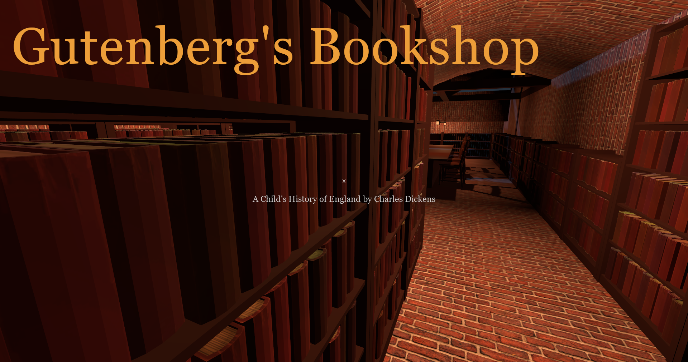

# Gutenberg's Bookshop

Gutenberg's Bookshop is a simple 3D project (dare I call it a game?) where you can walk around an old-timey bookshop, click on any book you see, and read it. The whole thing. Shakespeare? Dickens? Austin? All the coolest cats are here.

All of the text is drawn from the amazing [Project Gutenberg](https://www.gutenberg.org/), whom I am not affiliated with in any way.

## Current State of the Project

This is very much in the "held together by duct tape and prayers" prototyping phase, so expect a few bugs, poor design decisions, and overall jankiness - but as of now, it should still run and be reasonably stable. I'm still slowly working on this in my free time, but it isn't a high priority to finish anytime soon.

## Installation

If you want to just test this out, I'll build an executable...someday. I haven't gotten around to that yet - sorry!

The project is currently using the free [Godot game engine](https://godotengine.org/). If you're interested in developing the game or just running it from scratch, here's how to do that.

### For Development

1. Download and install the Standard version of [Godot (v3.0 or higher)](https://godotengine.org/download).
2. Clone this repo to a folder on your computer.
3. Open Godot and choose `Import`; browse to this repo and select the `project.godot` file.
4. After the project finishes loading, either hit `F5` or click the play button in the upper-right corner to start playing!

## Irresponsibly Brief Credits

As mentioned, all the books and text are drawn from [Project Gutenberg](https://www.gutenberg.org/).

Thanks to OpenGameArt for the [smoke animation images](https://opengameart.org/content/smoke-aura).

Thanks to Picfair for their [image of Bryggen](https://www.picfair.com/pics/06219341-bergen-norway-view-of-historical-buildings-houses-in-bryggen-hanseatic), which I lightly edited for the town backdrop.
